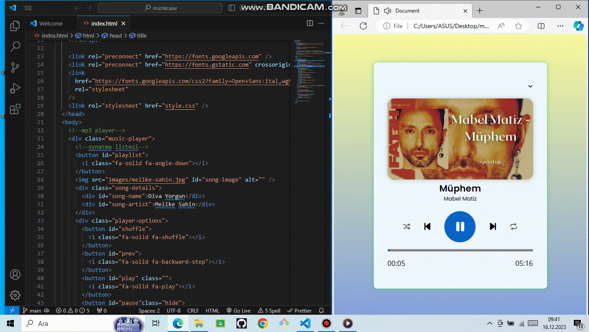

<h1> MÜZİK LİSTESİ</h1>
Bu proje, HTML5, CSS ve JavaScript kullanılarak oluşturulmuş web tabanlı müzik çalar projesidir. Oynat, duraklat, karıştır ve çalma listesi gibi özellikleri içerir.

<h2>Özellikler</h2>

Oynat ve duraklat kontrolleri
Karıştırma işlevselliği
Dinamik şarkı yükleme özelliğine sahip çalma listesi

<h2>ekran görüntüsü</h2>

